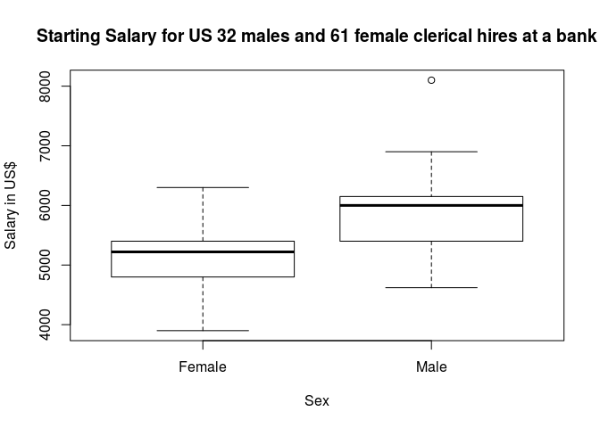
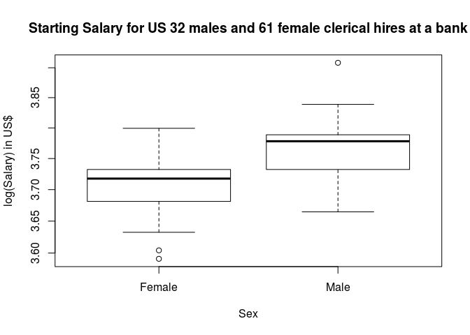

# MATH-650 Assignment 3
Saket Choudhary (USCID: 2170058637) (skchoudh@usc.edu)  
09/15/2015  


```r
salary.data <- read.csv('data_24.csv')
head(salary.data)
```

```
##   Salary    Sex
## 1   3900 Female
## 2   4020 Female
## 3   4290 Female
## 4   4380 Female
## 5   4380 Female
## 6   4380 Female
```

```r
salary.female <- salary.data[salary.data$Sex=="Female",]$Salary
salary.male <- salary.data[salary.data$Sex=="Male",]$Salary
```


```r
boxplot(Salary~Sex,data=salary.data, main="Starting Salary for US 32 males and 61 female clerical hires at a bank", log="",
    xlab="Sex", ylab="Salary in US$")
```

 

### Log transformed salary


```r
boxplot(log10(Salary)~Sex,data=salary.data, main="Starting Salary for US 32 males and 61 female clerical hires at a bank", log = "y",
    xlab="Sex", ylab="log(Salary) in US$")
```

 


### Part(b)


```r
tt<-t.test(log10(salary.male), log10(salary.female), alternative = "greater")
dm <- tt$estimate[1]-tt$estimate[2]
dm <- unname(dm)
CI1<-tt$conf.int[1]
CI2<-2*dm-CI1
```

p-value 5.0434814\times 10^{-8}
CI of mean difference: [0.0462048, 0.0814288]


```r
estimate <- exp(dm)
lower.ci <- exp(CI1)
upper.ci <- exp(CI2)
estimate
```

```
## [1] 1.065897
```

```r
lower.ci
```

```
## [1] 1.047289
```

```r
upper.ci
```

```
## [1] 1.084836
```


## Problem 25


```r
data <- read.csv('data_25.csv')
vietnam <- data[data$Veteran=="Vietnam",]$Dioxin
other <- data[data$Veteran=="Other",]$Dioxin

vietnam.without <- vietnam[c(1:644)]

tt.with <- t.test(vietnam, other, alternative="greater")
tt.with
```

```
## 
## 	Welch Two Sample t-test
## 
## data:  vietnam and other
## t = 0.29122, df = 136.96, p-value = 0.3857
## alternative hypothesis: true difference in means is greater than 0
## 95 percent confidence interval:
##  -0.3491265        Inf
## sample estimates:
## mean of x mean of y 
##  4.260062  4.185567
```


```r
tt.with <- t.test(vietnam.without, other, alternative="greater")
tt.with
```

```
## 
## 	Welch Two Sample t-test
## 
## data:  vietnam.without and other
## t = -0.0853, df = 117.33, p-value = 0.5339
## alternative hypothesis: true difference in means is greater than 0
## 95 percent confidence interval:
##  -0.4285707        Inf
## sample estimates:
## mean of x mean of y 
##  4.164596  4.185567
```
