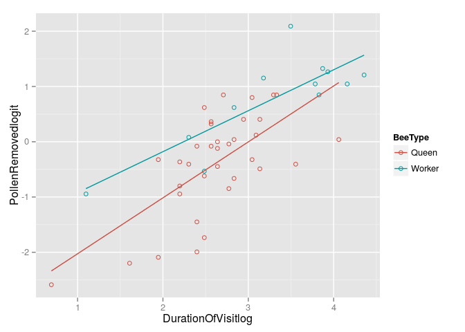
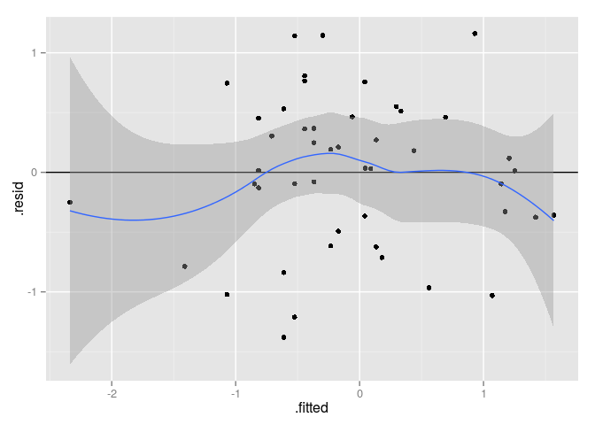

# MATH-650 Assignment 8
Saket Choudhary (USCID: 2170058637) (skchoudh@usc.edu)  
09/28/2015  

## Chapter 11: 10


```r
library(ggplot2)
data <- read.csv('data_ch9_16.csv', header=T)
data$PollenRemovedlogit = log(data$PollenRemoved/(1-data$PollenRemoved))
data$DurationOfVisitlog = log(data$DurationOfVisit)
ggplot(data, aes(x=DurationOfVisitlog, y=PollenRemovedlogit, color=BeeType)) +
    geom_point(shape=1) +
    scale_colour_hue(l=50) + 
    geom_smooth(method=lm,  
                se=FALSE)
```

 

\begin{align*}
\mu\{PollenRemovedLogit| DuratioOfVisitlog, BeeType \} &= \beta_0 + \beta_1 DurationOfVisitlog\\ 
&+ \beta_2 BeeType + \beta_3 BeeType*DurationOfVisitlog
\end{align*}


```r
lmfit <- lm(PollenRemovedlogit ~ BeeType + DurationOfVisitlog 
            + BeeType*DurationOfVisitlog, data=data)
summary(lmfit)
```

```
## 
## Call:
## lm(formula = PollenRemovedlogit ~ BeeType + DurationOfVisitlog + 
##     BeeType * DurationOfVisitlog, data = data)
## 
## Residuals:
##     Min      1Q  Median      3Q     Max 
## -1.3803 -0.3699  0.0307  0.4552  1.1611 
## 
## Coefficients:
##                                  Estimate Std. Error t value Pr(>|t|)    
## (Intercept)                       -3.0390     0.5115  -5.941 4.45e-07 ***
## BeeTypeWorker                      1.3770     0.8722   1.579    0.122    
## DurationOfVisitlog                 1.0121     0.1902   5.321 3.52e-06 ***
## BeeTypeWorker:DurationOfVisitlog  -0.2709     0.2817  -0.962    0.342    
## ---
## Signif. codes:  0 '***' 0.001 '**' 0.01 '*' 0.05 '.' 0.1 ' ' 1
## 
## Residual standard error: 0.6525 on 43 degrees of freedom
## Multiple R-squared:  0.6151,	Adjusted R-squared:  0.5882 
## F-statistic:  22.9 on 3 and 43 DF,  p-value: 5.151e-09
```

```r
r <- residuals(lmfit)
yh <- predict(lmfit)

p1<-ggplot(lmfit, aes(.fitted, .resid))+geom_point()
p1 <- p1 +geom_hline(yintercept=0)+geom_smooth() + 
geom_text(aes(label=ifelse((.resid>4*IQR(.resid)|.fitted>4*IQR(.fitted)),paste('', "\n", .fitted, ",", .resid),"")), hjust=1.1)
p1
```

```
## geom_smooth: method="auto" and size of largest group is <1000, so using loess. Use 'method = x' to change the smoothing method.
```

 

From the residual plot, there seem to be no outliers(see outlier detection part in the last code chunk wheere a outlier is defined if it is greater than 4*IQR(x)).

Also the p-value of cross interaction term $BeeTypeWorker:DurationofVisitlog$ is 0.342 and hence at a significance level of 0.05 can be safely neglected.


## Chapter 11: 21

$$ SS(\beta_0,\beta_1\dots \beta_n) = \sum_{i=1}^Nw_i(Y_i-\beta_0-\beta_1X_{1i}-\beta_2X_{2i}-\cdots-\beta_pX_{pi})^2 $$

\begin{align*}
\frac{\partial SS}{\partial \beta_0} &= 2 \sum_{i=1}^Nw_i(Y_i-\beta_0-\beta_1X_{1i}-\beta_2X_{2i}-\cdots-\beta_pX_{pi})\times -1 = 0\\
\end{align*}
\begin{align*}
n\beta_0\sum w_i+\beta_1\sum w_iX_{1i}+\beta_2\sum w_i X_{2i}+\cdots+\beta_p\sum w_i X_{pi} &= \sum_{i=1}^N w_iY_i\\
\end{align*}

\begin{align*}
\frac{\partial SS}{\partial \beta_1} &= 2 \sum_{i=1}^Nw_i(Y_i-\beta_0-\beta_1X_{1i}-\beta_2X_{2i}-\cdots-\beta_pX_{pi})\times -X_{1i} = 0\\
\end{align*}
\begin{align*}
\beta_0\sum w_iX_{1i}+\beta_1 \sum w_iX_{1i}^2+\beta_2\sum w_i X_{2i}X_{1i}+\cdots+\beta_p\sum w_i X_{pi}X_{1i} &= \sum_{i=1}^N w_iX_{1i}Y_i\\
\end{align*}


Similarly,

\begin{align*}
\frac{\partial SS}{\partial \beta_p} &= 2 \sum_{i=1}^Nw_i(Y_i-\beta_0-\beta_1X_{1i}-\beta_2X_{2i}-\cdots-\beta_pX_{pi})\times -X_{1i} = 0\\
\end{align*}
\begin{align*}
\beta_0\sum w_i X_{pi}+\beta_1 \sum w_i X_{1i}X_{pi}+\beta_2\sum w_i X_{2i}X_{pi}+\cdots+\beta_p\sum w_i X_{pi}^2 &= \sum_{i=1}^N w_iX_{pi}Y_i\\
\end{align*}

To prove that this is indeed the minimum, we need to show that $$\frac{\partial^2 SS}{\partial \beta_i^2}$$ is convex:

\begin{align*}
\frac{\partial^2 SS}{\partial \beta_0^2} &= 2w_i \geq 0
\end{align*}


\begin{align*}
\frac{\partial^2 SS}{\partial \beta_1^2} &= 2\sum_i w_i X_{1i}^2 \geq 0
\end{align*}

Similarly for any $1 \leq j \leq p$:
\begin{align*}
\frac{\partial^2 SS}{\partial \beta_j^2} &= 2\sum_i w_i X_{ji}^2 \geq 0
\end{align*}

And for $$ k \neq j $$:

\begin{align*}
\frac{\partial^2 SS}{\partial \beta_j \beta_k} &= 2\sum_i w_i X_{ji}X_{ki} \geq 0
\end{align*}

\begin{align*}
\begin{pmatrix}
\sum_i w_iX_{1i}^2 & \sum_i w_iX_{1i}X_{2i} & \dots & \sum_i w_iX_{1i}X_{ni}\\
\sum_i w_iX_{2i}X_{1i} & \sum_i w_iX_{2i}^2 & \dots & \sum_i w_iX_{2i}X_{ni}\\
\vdots & \vdots
\sum_i w_iX_{ni}X_{1i} & \sum_i w_iX_{2i}^2 & \dots & \sum_i w_iX_{ni}^2
\end{pmatrix}
\end{align*}
